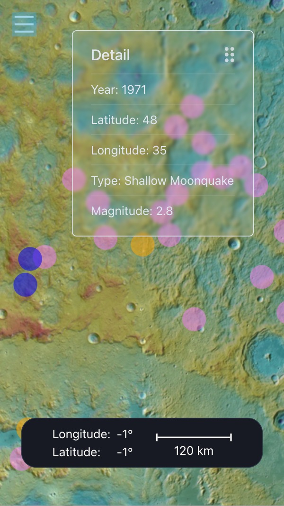

# Moonquake Map - NASA Space Apps Challange

LANG: [EN](/README.md) / **JP**

## プロジェクトについて

これは`NASA Space Apps Challange 2023`に向けたプロジェクトです。  
私たちは月面上での地震地図を制作しました。
2Dおよび3Dで描画された月震の情報を数多くのデータと組み合わせてみることができます！

[ここをクリックしてハッカソンのテーマを見る](https://www.spaceappschallenge.org/2023/challenges/make-a-moonquake-map-20/)(NASAのページです)

### デモを見る

[ここをクリックして完成デモへ](https://nasa-hackathon-2023-yokohama.vercel.app/)

| PC, 3D Vew         | SP, 2D View             |
| ------------------ | ----------------------- |
|  |  |

## Video

[](https://www.youtube.com/watch?v=IAwY9wcxcLQ)

## ライセンス

このプロジェクトは [AGPL LICENSE](./LICENSE) です。

## About us

私たちは`YokoTech`(旧名:`TechShiba`)です。  
横浜での地区予選後に改名を行いました。

### Members

Joraku Daijiro  
Hiyama Yudai  
Horike Haruki  
Taguchi Yumei  
Aoki Ren  
Yoshikoshi Jo

## インストール

まず以下のコマンドで依存関係をインストール

```bash
npm i
```

以下のコマンドでサーバーを起動

```bash
npm run dev
```

[http://localhost:3000](http://localhost:3000)で起動する。

## 導入済みライブラリ

### 整形・コーディング規則

- eslint
- prettier

### 主要ライブラリ

- [ChakraUI](https://chakra-ui.com/docs/components)
- [Three.js](https://threejs.org/)
- [react-three/fiber](https://docs.pmnd.rs/react-three-fiber/getting-started/introduction) (Three.jsをreactで使えるようにするライブラリ)
- react-three/drei
- MapLibre

### 便利系ライブラリ

- react-icons
- axios（REST APIの通信のため）
- ~~react-hook-form~~（未使用）
- ~~Swiper~~ (未使用)

## コーディング規則

### 関数

- function文は使わずに、なるべくアロー関数で定義する

### 命名規則

- snake_caseは基本的に使用しない（✖️user_data）
- 変数名 と 関数名 は基本的に先頭小文字のcamelCase（⭕️ useTest, ✖️ use_test , UseTest）
- コンポーネント名 と 型定義 は先頭大文字のPascalCase（⭕️ UserData, ✖️userData ）

### その他

- ページ本体は pagesディレクトリ以下に記述し、ファイル名は[camelCase].tsxにする
- ファイル名とページコンポーネントは同じ名前にする（ただしコンポーネント名はPascalCase、ページ名はcamelCase）
- コンポーネントは components以下に記述し、ファイル名は[camelCase].tsxにする
- ロジックだけを記述した関数は util 以下に記述し、[camelCase].tsにする(JSXを書かないので.tsxにしない！！)
